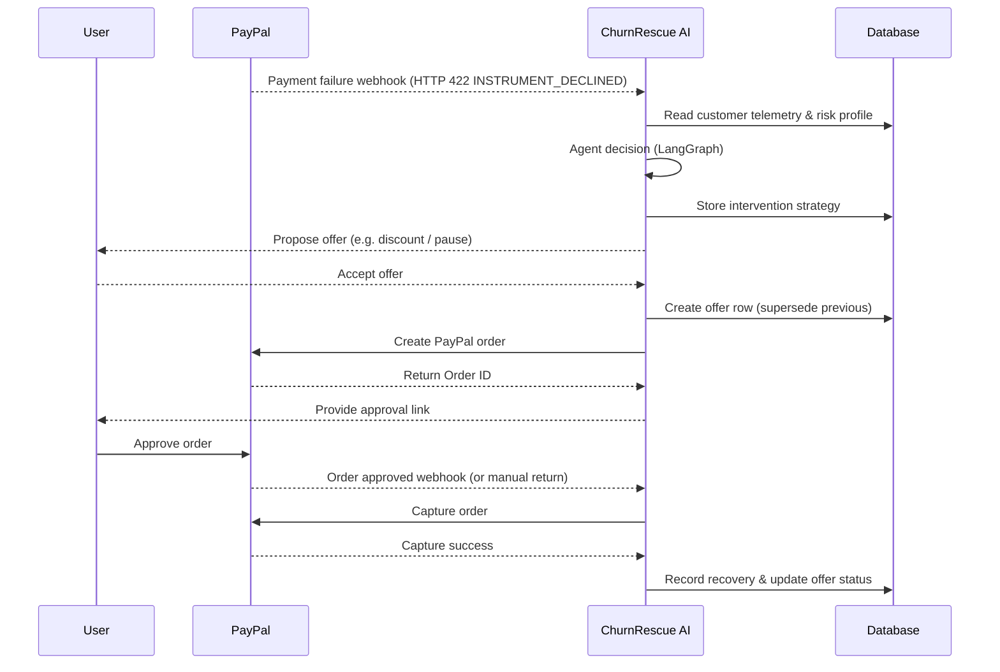

# ChurnRescue AI Architecture

```mermaid
sequenceDiagram
    participant User
    participant PayPal
    participant Agent as ChurnRescue AI
    participant DB as Database

    PayPal-->>Agent: Payment failure webhook (HTTP 422 INSTRUMENT_DECLINED)
    Agent->>DB: Read customer telemetry & risk profile
    Agent->>Agent: Agent decision (LangGraph)
    Agent->>DB: Store intervention strategy
    Agent-->>User: Propose offer (e.g. discount / pause)
    User-->>Agent: Accept offer
    Agent->>DB: Create offer row (supersede previous)
    Agent->>PayPal: Create PayPal order
    PayPal-->>Agent: Return Order ID
    Agent-->>User: Provide approval link
    User->>PayPal: Approve order
    PayPal-->>Agent: Order approved webhook (or manual return)
    Agent->>PayPal: Capture order
    PayPal-->>Agent: Capture success
    Agent->>DB: Record recovery & update offer status
```
